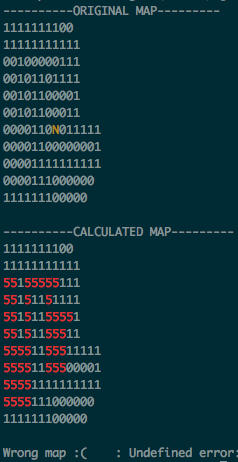

## Map Boundaries 🗺
A simple **flood fill algorithm** to check inner map boundaries. Map must be formed by walls (represented as 1), floor (as 0) and player (N, W, E or S). Player must be completelly surrounded by walls in order to consider a valid map.

### Examples
Map will be filled with character '5' from the player position, spreading to all posibble positions. 

**_Map sample to be studied:_**

**_Successfull output with filled map:_**

### Usage
Clone repo and compile the code as follows. You can use maps found in _map_samples_ folder or create yours. Although not mandatory map extension should be ".cub"

`$>gcc -Wall -Werror -Wextra get_next_line.c get_next_line_utils.c map_boundaries.c -o map_boundaries`
`$>./map_boundaries map_samples/map.cub` _(or any  other map)_

### Resources
If you want to know a little bit about the flood fill algorithm check: https://en.wikipedia.org/wiki/Flood_fill
